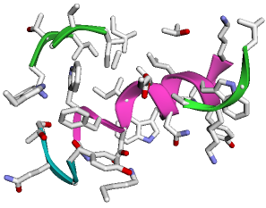

# afpdb - An Efficient Protein Structure Manipulation Tool

The emergence of AlphaFold and subsequent protein AI models has revolutionized protein design. To maximize the probability of success, the AI-driven protein design process involves analyzing thousands of protein structures. This includes handling structure file read/write operations, aligning structures and measuring structural deviations, standardizing chain/residue labels, extracting residues, identifying mutations, and creating visualizations. However, existing programming packages do not fully address these challenges. To bridge this gap, we introduce the afpdb module. Built upon AlphaFold’s numpy architecture and leveraging the intuitive contig syntax proposed by RFDiffusion, afpdb streamlines structure analyses. While supplementing BioPython with dozens of methods commonly used in protein AI design but not readily available elsewhere; it also offers a user-friendly interface that seamlessly integrates with PyMOL’s visualization capabilities.

## Demo

### Structure Read & Summary
```
# load the ab-ag complex structure 5CIL from PDB
p=Protein("5cil")
# show key statistics summary of the structure
p.summary().display()
```
Output
```
    Chain    Sequence                                                                                                                                                                                                                                            Length    #Missing Residues    First Residue Name    Last Residue Name
--  -------  --------------------------------------------------------------------------------------------------
 0  H        VQLVQSGAEVKRPGSSVTVS...        220                   20                     2                  227
 1  L        EIVLTQSPGTQSLSPGERAT...        212                    0                     1                  211
 2  P        NWFDITNWLWYIK                   13                    0                   671                  683
```
### Residue Relabeling

```
print("Old P chain residue numbering:", p.rs("P").name(), "\n")

Output:
Old P chain residue numbering: ['671', '672', '673', '674', '675', '676', '677', '678', '679', '680', '681', '682', '683'] 

p.renumber("RESTART")
print("New P chain residue numbering:", p.rs("P").name(), "\n")

Output:
New P chain residue numbering: ['1', '2', '3', '4', '5', '6', '7', '8', '9', '10', '11', '12', '13'] 

p.summary()
```
Output

```
    Chain    Sequence                                                                                                                                                                                                                                            Length    #Missing Residues    First Residue Name    Last Residue Name
--  -------  --------------------------------------------------------------------------------------------------
 0  H        VQLVQSGAEVKRPGSSVTVS...        220                   20                     1                  226
 1  L        EIVLTQSPGTQSLSPGERAT...        212                    0                     1                  211
 2  P        NWFDITNWLWYIK                   13                    0                     1                   13
 ```
### Replace Missing Residues for AI Prediction
```
print("Sequence for AlphaFold modeling, with missing residues replaced by Glycine:")
print(">5cil\n"+p.seq(gap="G")+"\n")
```
Output
```
Sequence for AlphaFold modeling, with missing residues replaced by Glycine:
>5cil
VQLVQSGAEVKRPGSSVTVSCKASGGSFSTYALSWVRQAPGRGLEWMGGVIPLLTITNYAPRFQGRITITADRSTSTAYLELNSLRPEDTAVYYCAREGTTGDGDLGKPIGAFAHWGQGTLVTVSSASTKGPSVFPLAPSGGGGGGGGGTAALGCLVKDYFPEPVTVGSWGGGGNSGALTSGGVHTFPAVLQSGSGLYSLSSVVTVPSSSLGTGGQGTYICNVNHKPSNTKVDKKGGVEP:EIVLTQSPGTQSLSPGERATLSCRASQSVGNNKLAWYQQRPGQAPRLLIYGASSRPSGVADRFSGSGSGTDFTLTISRLEPEDFAVYYCQQYGQSLSTFGQGTKVEVKRTVAAPSVFIFPPSDEQLKSGTASVVCLLNNFYPREAKVQWKVDNALQSGNSQESVTEQDSKDSTYSLSSTLTLSKADYEKHKVYACEVTHQGLSSPVTKSFNR:NWFDITNWLWYIK
```
### Interface Computing
```
# identify H,L chain residues within 4A to antigen P chain
binders, df_dist=p.rs_around("P", dist=4)

# show the distance of binder residues to antigen P chain
df_dist[:5].display()
```
Output
```
     chain_a      resn_a    resn_i_a    resi_a  res_a    chain_b    resn_b      resn_i_b    resi_b  res_b       dist  atom_a    atom_b
---  ---------  --------  ----------  --------  -------  ---------  --------  ----------  --------  -------  -------  --------  --------
408  P                 6           6       437  T        H          94                94        97  E        2.63625  OG1       OE2
640  P                 4           4       435  D        L          32                32       252  K        2.81482  OD1       NZ
807  P                 2           2       433  W        L          94                94       314  S        2.91194  N         OG
767  P                 1           1       432  N        L          91                91       311  Y        2.9295   ND2       O
526  P                 7           7       438  N        H          99E               99       107  K        3.03857  ND2       CE
```
### Residue Selection & Boolean Operations
```
# create a new PDB file only containing the antigen and binder residues
p=p.extract(binders | p.rs("P"))
```
### Structure I/O
```
# save the new structure into a local PDB file
p.save("binders.pdb")
```
### Structure Display within Jupyter Notebook
```
# display the PDB struture, default is show ribbon and color by chains.
p.show(show_sidechains=True)
```
Output (It will be 3D interactive within Jupyter Notebook)


## Tutorial

To learn and practice afpdb, open our [tutorial notebook](https://colab.research.google.com/github/data2code/afpdb/blob/main/tutorial/afpdb.ipynb) it in Google Colab.
